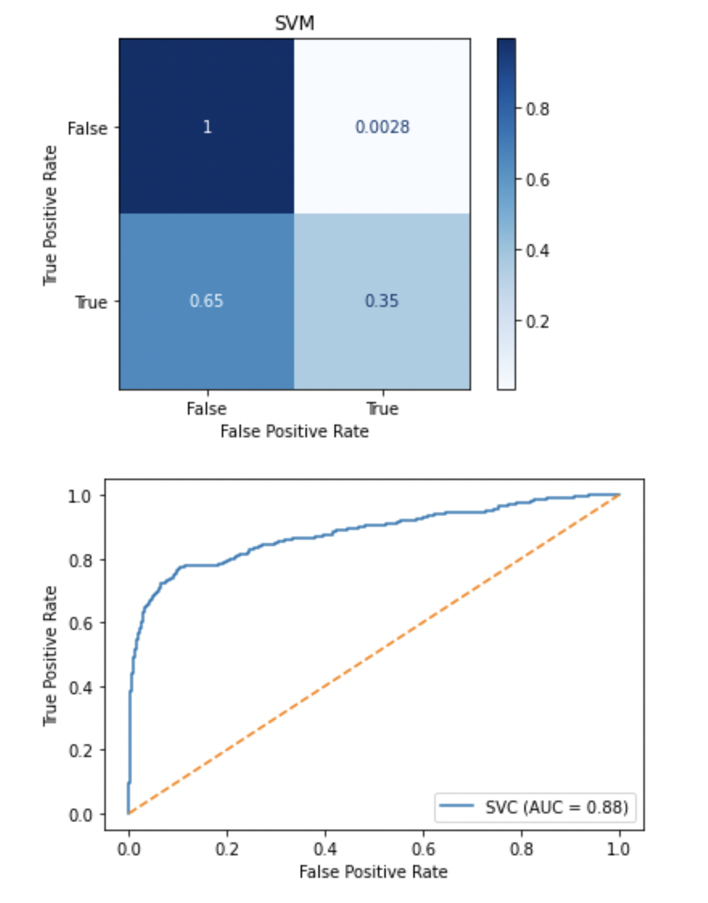
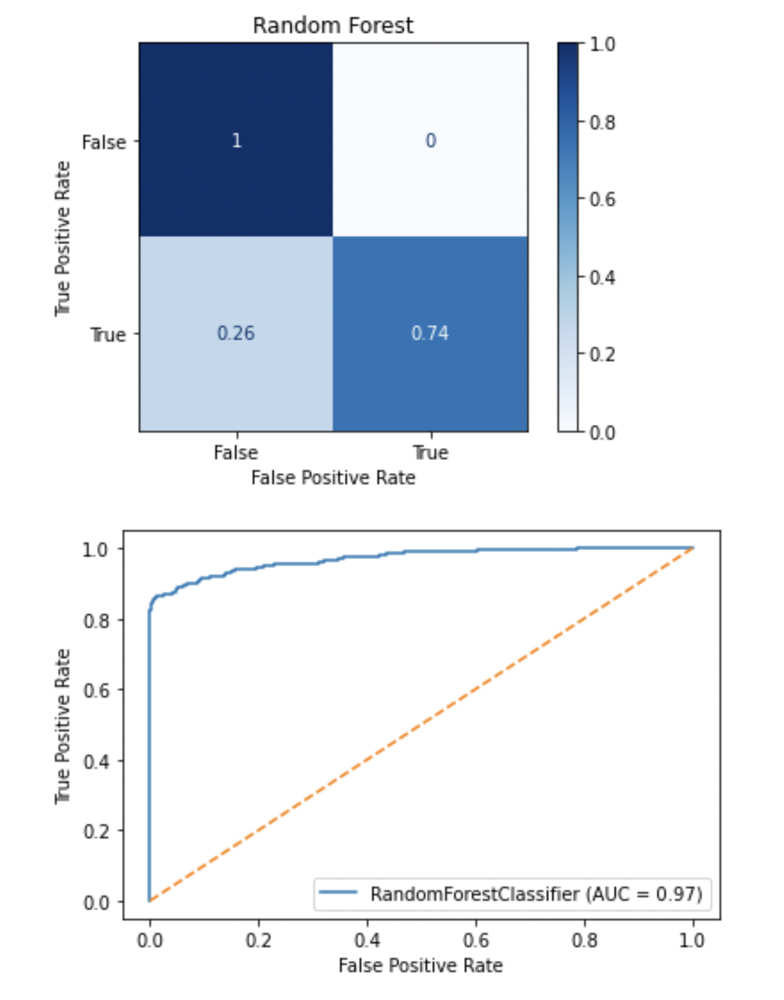
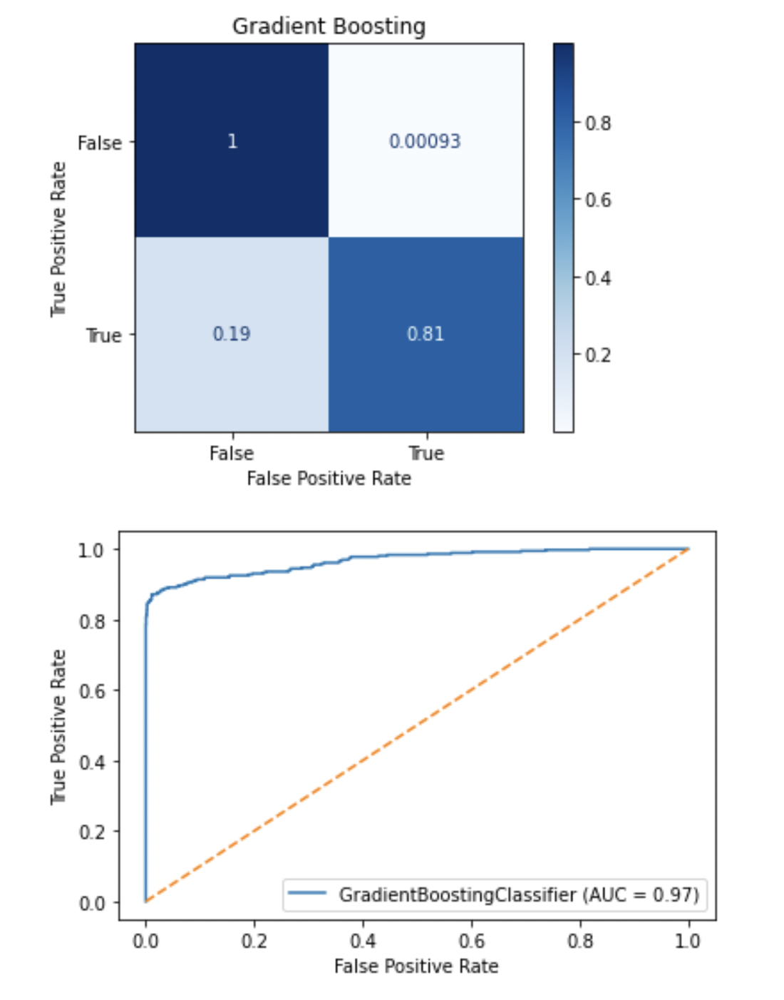
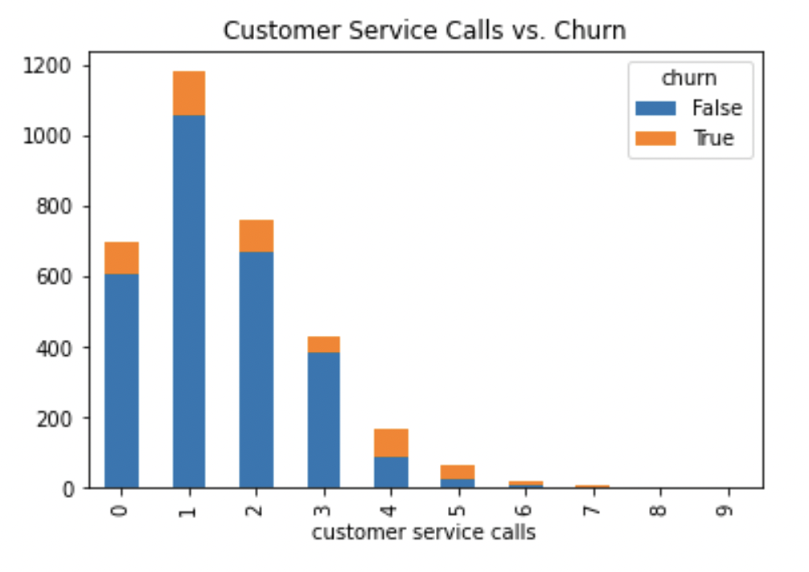
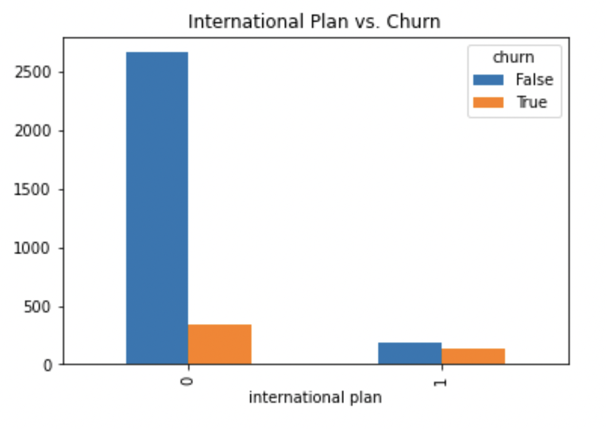
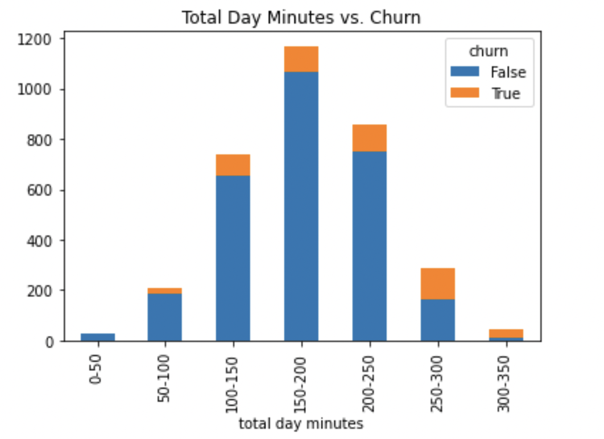

# Phase 3 Project : Churn Analysis

Author: Kregg Jackson

## Project Overview

For this project I used multiple classifier models to find out why customers were churning.

## The Data

The phone company’s data frame originally consisted of 21 columns with about 3,300 rows. The description of the column names can be found at [kaggle.com](https://www.kaggle.com/datasets/becksddf/churn-in-telecoms-dataset?datasetId=2667&sortBy=voteCount).

## Methods

I built multiple classifier models after cleaning and evaluating the data. The cleaning process consisted of formatting the data so the classifers can read the data, balancing class imbalance on the dependent variable, and dropping redundant columns. Next I built vizs to visually represent and better understand the predictors relationship with the dependendent variable. Then I built five classifier models and selected the most important features from the best performing model. 

## Results

### Support Vector Machine

### Random Forests

### Gradient Boosting

## Conclusions

* The most important features are `customer service calls`, `total day_minutes`, and `international plan`.

* The gradient boosting model reported `customer service calls` was the most important factor whether a customer will churn, I think this is due to frustration with the customer service department. I recommend the phone company invest in improving the customer service department. 

* Almost half of the customers who opt in for the international plan will cancel their subscription. The correlation could be due to the international services being overpriced I advise reducing the price of the international plan.

* When customer pass 250 minutes per day it is much more likely they end their subscription. Customers who use this many minutes may feel the plans available don’t suit them, I’d suggest adding an unlimited minutes phone plan option.

### Next Steps

* Additional analysis could provide further insights into how to improve likelihood of renovation success.

* I could run cross validation on the churn data to correct the class imbalance differently and see if that is more accurate than class weight and SMOTE.

* Remove more redundant columns the `total day charge` and `total day minutes` columns are too correlated.

## For More Information
See the full anaysis in the [Jupyter Notebook]([https://github.com/kreggthegoat/dsc-phase-3-project](https://github.com/kreggthegoat/dsc-phase-3-project/blob/main/notebook.ipynb)) or review the [presentation](https://docs.google.com/presentation/d/1LLzdQOGjr92wctMzBrxpsH1rS9NlM1fWf6YMQbX8LGI/edit?usp=sharing).

## Thank You
